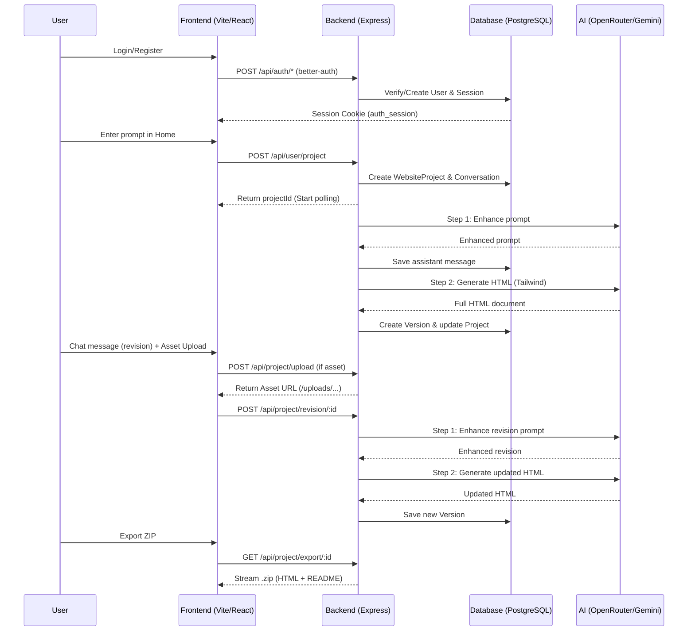

# CLAUDE.md — Site Builder Project Context

> **For AI Agents**: Read this file first. It contains everything you need to understand this codebase without scanning every directory.

---

## 1. Project Overview

**Site Builder** is an AI-powered, SaaS-style web application that lets users generate complete single-page HTML websites from a text prompt. The AI pipeline enhances the user's prompt and then generates a fully styled, self-contained HTML file using Tailwind CSS. Users can iteratively revise their site via a chat interface, view version history, roll back to previous versions, publish their sites publicly, remix community projects, export their site as a ZIP, apply AI-driven theme shifts, and upload custom image assets.

---

## 2. Monorepo Structure

```
site-builder/                   ← project root
├── client/                     ← React frontend (Vite)
├── server/                     ← Node.js/Express backend
├── uploads/                    ← Static asset storage (served at /uploads)
├── backend_flow.md             ← Detailed backend architecture walkthrough
├── assumptions_dependencies.md ← Critical external dependencies & assumptions
├── design_constraints.md       ← Design constraints doc
├── implementation_plan.md      ← Feature implementation plan & status
├── swot_analysis.md            ← SWOT analysis
├── user_classes.md             ← User types & roles
└── CLAUDE.md                   ← This file
```

Each sub-project (`client/`, `server/`) has its **own `package.json`** — they are **not** linked via a workspace manager. Run `npm install` separately in each.

---

## 3. Tech Stack

### Frontend (`client/`)
| Package | Version | Role |
|---|---|---|
| React | 19 | UI framework |
| Vite | 7 | Build tool & dev server |
| TypeScript | ~5.9 | Type safety |
| TailwindCSS | v4 | Styling (v4 config, NOT v3) |
| `react-router-dom` | v7 | Client-side routing |
| `better-auth` / `@daveyplate/better-auth-ui` | ^1.4.5 / ^3.2.13 | Auth client + pre-built UI |
| `axios` | ^1.13 | HTTP client (pre-configured in `configs/axios.ts`) |
| `lucide-react` | ^0.555 | Icon set |
| `sonner` | ^2.0 | Toast notifications |

### Backend (`server/`)
| Package | Version | Role |
|---|---|---|
| Express | v5 | HTTP server |
| TypeScript + `tsx` | ^5.9 / ^4.21 | Runtime TypeScript execution |
| `better-auth` | ^1.4.5 | Auth server (session management, email+password) |
| Prisma | v7 | ORM (PostgreSQL) |
| `pg` + `@prisma/adapter-pg` | ^8.16 / ^7.1 | Postgres driver |
| `openai` (npm SDK) | ^6.10 | AI client (pointed at OpenRouter, NOT OpenAI) |
| `multer` | ^2.1.1 | Multipart file uploads |
| `archiver` | ^8.0 | In-memory ZIP generation for export |
| `dotenv` | ^17 | Env variable loading |
| `cors` | ^2.8 | CORS middleware |
| `docx` | ^9.6.1 | (Dev utility) Word document generation |

---

## 4. Client Structure (`client/src/`)

```
client/src/
├── App.tsx                  ← Root router, Navbar visibility logic
├── main.tsx                 ← React entry point, wraps with <Providers>
├── providers.tsx            ← Wraps app in BrowserRouter + any global context
├── index.css                ← Global styles, Tailwind v4 directives
├── pages/
│   ├── Home.tsx             ← Landing page: prompt form → POST /api/user/project
│   ├── Projects.tsx         ← Main editor: chat sidebar + live HTML preview
│   ├── MyProjects.tsx       ← Dashboard: lists the user's projects
│   ├── Preview.tsx          ← Full-screen preview of a specific version
│   ├── Community.tsx        ← Browse all published projects (public)
│   ├── View.tsx             ← Public view of a single published project
│   ├── Pricing.tsx          ← Pricing/plans page (UI only, not linked to real billing)
│   ├── Settings.tsx         ← Account settings page
│   ├── Loading.tsx          ← Generic loading screen
│   └── auth/
│       └── AuthPage.tsx     ← Login/register via better-auth-ui component
├── components/
│   ├── Navbar.tsx           ← Top nav with auth state, credits display
│   ├── Sidebar.tsx          ← Chat interface + version history panel (in Projects.tsx)
│   ├── EditorPanel.tsx      ← Code editor panel for manual HTML edits
│   ├── ProjectPreview.tsx   ← <iframe> wrapper that renders the generated HTML
│   ├── LoaderSteps.tsx      ← Animated step-by-step loading indicator
│   └── Footer.tsx           ← Simple footer component
├── configs/
│   └── axios.ts             ← Axios instance with baseURL from env
├── lib/
│   ├── auth-client.ts       ← better-auth client instance (used everywhere for session)
│   └── utils.ts             ← shadcn-style `cn()` utility (clsx + tailwind-merge)
└── types/                   ← Shared TS types (if any)
```

### Client Routes (`App.tsx`)
| Path | Component | Auth Required |
|---|---|---|
| `/` | `Home` | No (redirects to login on submit) |
| `/projects` | `MyProjects` | Yes |
| `/projects/:projectId` | `Projects` | Yes |
| `/preview/:projectId` | `Preview` | Yes |
| `/preview/:projectId/:versionId` | `Preview` (specific version) | Yes |
| `/community` | `Community` | No |
| `/view/:projectId` | `View` | No (public) |
| `/auth/:pathname` | `AuthPage` | No |
| `/account/settings` | `Settings` | Yes |
| `/pricing` | `Pricing` | No |
| `/loading` | `Loading` | No |

> **Navbar is hidden** on `/projects/:id`, `/view/:id`, and `/preview/:id` routes.

---

## 5. Server Structure (`server/`)

```
server/
├── server.ts                ← Entry point (Express app, port 3000)
├── routes/
│   ├── userRoutes.ts        ← Mounted at /api/user
│   └── projectRoutes.ts     ← Mounted at /api/project
├── controllers/
│   ├── userController.ts    ← User/project creation, credits fetch, publish toggle
│   └── projectController.ts ← Revisions, rollback, preview, published sites, remix, export, theme, upload
├── middlewares/
│   ├── auth.ts              ← `protect` middleware — validates better-auth session, attaches req.userId
│   └── upload.ts            ← multer config — disk storage to server/uploads/, 5MB limit, images only
├── lib/
│   ├── auth.ts              ← better-auth server instance (PostgreSQL adapter, cookie config)
│   └── prisma.ts            ← PrismaClient singleton
├── configs/
│   └── openai.ts            ← OpenAI SDK client pointed at OpenRouter
├── types/
│   └── express.d.ts         ← Augments Express Request to include `userId?: string`
├── prisma/
│   ├── schema.prisma        ← Database schema
│   └── migrations/          ← Migration history
├── generated/
│   └── prisma/              ← Prisma client output (non-default location)
├── uploads/                 ← Uploaded user assets (served statically at /uploads)
├── prisma.config.ts         ← Prisma config file
├── vercel.json              ← Vercel deployment config (routes all traffic to server.ts)
└── tsconfig.json
```

---

## 6. API Routes Reference

### `/api/auth/*` — Handled internally by `better-auth` (not in routes files)

### `/api/user` — `userRoutes.ts`
| Method | Path | Auth | Handler | Description |
|---|---|---|---|---|
| GET | `/api/user/credits` | ✅ | `getUserCredits` | Returns user's current credit count |
| POST | `/api/user/project` | ✅ | `createUserProject` | Creates project + runs AI generation pipeline |
| GET | `/api/user/project/:projectId` | ✅ | `getUserProject` | Returns project with conversation + versions |
| GET | `/api/user/projects` | ✅ | `getUserProjects` | Returns all projects for the user |
| GET | `/api/user/publish-toggle/:projectId` | ✅ | `togglePublish` | Toggles `isPublished` on a project |

### `/api/project` — `projectRoutes.ts`
| Method | Path | Auth | Handler | Description |
|---|---|---|---|---|
| POST | `/api/project/revision/:projectId` | ✅ | `makeRevision` | Runs AI revision pipeline on existing code |
| PUT | `/api/project/save/:projectId` | ✅ | `saveProjectCode` | Saves manually edited HTML code |
| GET | `/api/project/rollback/:projectId/:versionId` | ✅ | `rollbackToVersion` | Reverts project to an older version |
| DELETE | `/api/project/:projectId` | ✅ | `deleteProject` | Deletes project (cascades to conversations + versions) |
| GET | `/api/project/preview/:projectId` | ✅ | `getProjectPreview` | Returns project + all versions for preview |
| GET | `/api/project/published` | ❌ | `getPublishedProjects` | Returns all published projects (Community page) |
| GET | `/api/project/published/:projectId` | ❌ | `getProjectById` | Returns HTML code of a published project |
| POST | `/api/project/remix/:projectId` | ✅ | `remixProject` | Clones a published project to the user's workspace |
| GET | `/api/project/export/:projectId` | ✅ | `exportProjectZip` | Returns an in-memory ZIP file of the project |
| POST | `/api/project/theme/:projectId` | ✅ | `applyTheme` | Uses AI to re-theme the project's Tailwind CSS classes |
| POST | `/api/project/upload` | ✅ | `uploadAsset` | Handles asset uploads using multer (images only, 5MB max) |

### Static Files
| Path | Source | Description |
|---|---|---|
| `/uploads/*` | `server/uploads/` | Uploaded user image assets served statically |

---

## 7. System Architecture & Flow Diagram



---

## 8. Database Schema (Prisma / PostgreSQL)

Prisma client is generated to `server/generated/prisma/` (non-default path set in `schema.prisma`).

### Core Models

| Model | Key Fields | Purpose |
|---|---|---|
| `User` | `id`, `email`, `name`, `credits` (default: 20), `totalCreation`, `emailVerified` | App users |
| `WebsiteProject` | `id`, `name`, `initial_prompt`, `current_code`, `current_version_index`, `isPublished`, `userId` | A user's website project |
| `Conversation` | `id`, `role` (user/assistant enum), `content`, `timestamp`, `projectId` | Chat history per project |
| `Version` | `id`, `code`, `description`, `timestamp`, `projectId` | Code snapshot per revision |
| `Transaction` | `id`, `isPaid`, `planId`, `amount`, `credits`, `userId` | Payment/credit purchase records (schema only, not enforced) |

### Auth Models (managed by `better-auth` — do not modify manually)
`Session`, `Account`, `Verification`

### Relations
- `User` → many `WebsiteProject`
- `WebsiteProject` → many `Conversation` (cascade delete)
- `WebsiteProject` → many `Version` (cascade delete)
- `User` → many `Transaction` (cascade delete)
- `User` → many `Session`, `Account` (managed by better-auth)

---

## 9. 🤖 Core AI Pipeline (Two-Step Pattern)

This is the most important architectural pattern. **Every generation and revision runs two sequential AI calls.**

**Step 1 — Prompt Enhancement**
- The user's raw text is sent to the AI with a system prompt that instructs it to act as a "prompt enhancement specialist"
- The AI returns a more detailed, design-aware version of the prompt
- Result is logged to the `Conversation` table

**Step 2 — Code Generation / Modification**
- The enhanced prompt (+ existing code for revisions) is sent to the AI
- The AI returns a **complete, standalone HTML file** using Tailwind CSS v4 CDN
- Code is stripped of any markdown fences and saved as a new `Version`
- `WebsiteProject.current_code` and `current_version_index` are updated

**Model used:** `google/gemini-2.5-flash`  
**SDK:** `openai` npm package  
**API endpoint:** OpenRouter (`https://openrouter.ai/api/v1`) — the OpenAI SDK is used purely as a compatibility layer to call OpenRouter, which routes the request to Google's Gemini model.

The generated HTML always includes:
```html
<script src="https://cdn.jsdelivr.net/npm/@tailwindcss/browser@4"></script>
```
This CDN is critical — the generated sites have no build step.

---

## 10. Authentication System (`better-auth`)

| Side | File | Purpose |
|---|---|---|
| Server | `server/lib/auth.ts` | Creates the `auth` instance with PostgreSQL adapter, email+password, cookie config |
| Server | `server/middlewares/auth.ts` | `protect(req, res, next)` — reads session, attaches `req.userId` |
| Server | `server.ts` | Mounts `toNodeHandler(auth)` at `/api/auth/*` |
| Client | `client/src/lib/auth-client.ts` | Creates `authClient` used via `authClient.useSession()` |
| Client | `client/src/pages/auth/AuthPage.tsx` | UI powered by `@daveyplate/better-auth-ui` |

### Auth Cookie Configuration
The session cookie is named **`auth_session`** (not the better-auth default). Settings in `server/lib/auth.ts`:
- `httpOnly: true`
- `secure: true` in production
- `sameSite: 'none'` in production, `'lax'` in development

`better-auth` also requires `BETTER_AUTH_URL` in addition to `BETTER_AUTH_SECRET` — see env vars below.

`better-auth` manages its own DB tables (`session`, `account`, `verification`) — do not create or modify these in Prisma manually.

---

## 11. Asset Upload System

| File | Role |
|---|---|
| `server/middlewares/upload.ts` | multer config: disk storage to `server/uploads/`, 5MB max, JPEG/PNG/WebP/GIF only |
| `server/uploads/` | Physical storage directory (auto-created by middleware if missing) |
| `server.ts` | Serves `server/uploads/` statically at `/uploads` via `express.static` |

Uploaded files are given a unique filename: `{fieldname}-{timestamp}-{random}{ext}`.  
The frontend receives the public URL as `/uploads/{filename}` and injects it into the AI prompt.

---

## 12. Credits System — Schema Only (Not Enforced in Code)

The `User` model has a `credits` field (default: `20`) and a `Transaction` model exists in the schema. The `GET /api/user/credits` endpoint reads and returns the credit count.

**⚠️ However:** No code currently deducts credits when a project is created or revised. No code validates credits before allowing generation. The credits/billing system is **schema-level scaffolding only** — it is **not yet implemented** in the controllers. (Credit System enforcement was explicitly **cancelled** — see `implementation_plan.md`.)

If you are asked to implement credit deduction, add it to `createUserProject` (in `userController.ts`) and `makeRevision` (in `projectController.ts`) after validating the user has sufficient credits.

---

## 13. Deployment (Vercel)

The server has a `vercel.json` at `server/vercel.json` that configures Vercel deployment:
- Build: `server.ts` via `@vercel/node`
- All routes (`/(.*)`) are proxied to `server.ts`

> **Note:** The `uploads/` directory is **ephemeral on Vercel** (serverless functions have a read-only filesystem). For production, uploaded assets should be moved to an external storage provider (S3, Cloudinary, etc.).

---

## 14. Environment Variables

### `server/.env`
| Variable | Purpose |
|---|---|
| `DATABASE_URL` | PostgreSQL connection string (used by Prisma) |
| `AI_API_KEY` | OpenRouter API key (used in `configs/openai.ts`) |
| `BETTER_AUTH_SECRET` | Secret for better-auth session signing |
| `BETTER_AUTH_URL` | Base URL of the backend server (required by better-auth) |
| `TRUSTED_ORIGINS` | Comma-separated list of allowed CORS origins (e.g., `http://localhost:5173`) |
| `NODE_ENV` | `production` or `development` — controls cookie `secure`/`sameSite` settings |

### `client/.env`
| Variable | Purpose |
|---|---|
| `VITE_API_URL` | Backend base URL used by the Axios instance |

---

## 15. Development Commands

```bash
# Start the backend (with hot reload via nodemon)
cd server && npm run server      # uses nodemon + tsx

# Start the backend (no reload)
cd server && npm start           # uses tsx directly

# Start the frontend dev server
cd client && npm run dev         # Vite on http://localhost:5173

# Regenerate Prisma client after schema changes
cd server && npm run prisma:generate   # runs: npx prisma generate

# Run a Prisma migration
cd server && npx prisma migrate dev --name <migration_name>

# Build frontend for production
cd client && npm run build       # outputs to client/dist/

# Build backend TypeScript
cd server && npm run build       # runs: tsc
```

---

## 16. Implemented Features (Current State)

All 5 originally planned high-impact features have been implemented. See `implementation_plan.md` for details.

| Feature | Status | Endpoint |
|---|---|---|
| AI Theme Shifter | ✅ Done | `POST /api/project/theme/:projectId` |
| Custom Asset Uploads | ✅ Done | `POST /api/project/upload` + static `/uploads` |
| Export Project as ZIP | ✅ Done | `GET /api/project/export/:projectId` |
| SEO/OpenGraph Metadata via AI | ✅ Done | Built into prompt enhancement step |
| Project Forking / Remixing | ✅ Done | `POST /api/project/remix/:projectId` |
| Credit System Enforcement | ❌ Cancelled | Schema scaffolding only |

---

## 17. Existing Documentation Files (Root Level)

| File | Contents |
|---|---|
| `backend_flow.md` | Detailed walkthrough of the server architecture and data flow |
| `assumptions_dependencies.md` | Critical external dependencies (Gemini API, Tailwind CDN, better-auth, Prisma/PG, OpenAI SDK) and assumptions |
| `design_constraints.md` | Design constraints (external APIs, TypeScript enforcement, DB/storage, security/XSS sandboxing, prompt engineering) |
| `implementation_plan.md` | High-impact feature plan with implementation status (all done except credit enforcement, which was cancelled) |
| `swot_analysis.md` | SWOT analysis of the platform |
| `user_classes.md` | User types and their capabilities |

---

## 18. ⚠️ Critical Notes for Agents

1. **OpenAI SDK ≠ OpenAI API**: The `openai` npm package is configured with `baseURL: "https://openrouter.ai/api/v1"` in `server/configs/openai.ts`. It calls **OpenRouter**, which then calls **Google Gemini** (`google/gemini-2.5-flash`). Do not assume this calls OpenAI's servers.

2. **Prisma client is in a custom path**: Generator output is `../generated/prisma` relative to `schema.prisma`. Import from `"../generated/prisma"` in server code, not from `"@prisma/client"`.

3. **TailwindCSS v4 on the client**: The client uses Tailwind v4, which has a different configuration system (no `tailwind.config.js` by default). Do not apply v3 patterns.

4. **JSON body limit is 50mb**: Set intentionally in `server.ts` because the AI-generated HTML files can be very large strings.

5. **Response is sent before AI pipeline completes**: In `createUserProject`, `res.json({ projectId })` is called **before** the two AI calls run. The client polls or uses long-polling — do not restructure this flow without understanding the frontend's expectation.

6. **Credits are NOT deducted anywhere in the current code**: The `credits` column and `Transaction` model are future scaffolding. Do not assume credits are being charged.

7. **`better-auth` auth tables are auto-managed**: `session`, `account`, `verification` tables are owned by `better-auth`. Do not write migrations targeting these models manually.

8. **Code stripping regex**: Generated HTML is cleaned with `.replace(/```[a-z]*\n?/gi, "").replace(/```$/g, "").trim()` before saving — Gemini sometimes wraps output in markdown fences despite instructions.

9. **`upload.ts` middleware is separate**: The `upload` multer instance lives in `server/middlewares/upload.ts` and is imported directly by `projectRoutes.ts`. It is **not** a global middleware — it is applied only to the `POST /api/project/upload` route.

10. **`BETTER_AUTH_URL` is required**: The `server/lib/auth.ts` reads `process.env.BETTER_AUTH_URL`. This must be set in `.env` (e.g., `http://localhost:3000`) or better-auth will fail to resolve redirect URLs.

11. **`Pricing.tsx` page is UI-only**: The `Pricing` page exists in the client but is not connected to any real billing or Stripe integration. It is a placeholder for future monetization.

12. **`vercel.json` is inside `server/`**: Deploy the `server/` directory to Vercel (not the root). The `vercel.json` at `server/vercel.json` handles routing.
